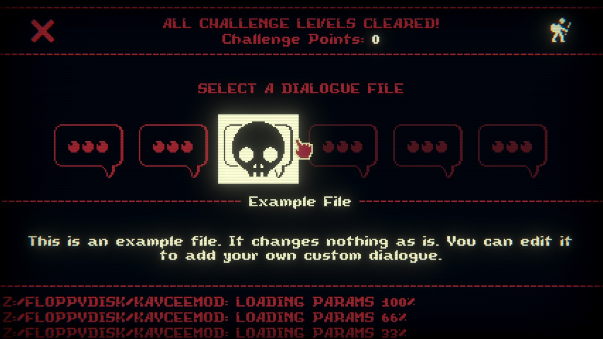

This is a BepInEx plugin mod made for Inscryption.
This mod lets you load custom dialogue for the three first bosses in the game (the Prospector, the Angler and the Trapper/Trader) with a JSON file.

It adds a custom menu screen to Kaycee's Mod, which looks like this:



This mod doesn't change your original game files and shouldn't affect your main game save data, but making a backup of your save file before installation is still advised.

## Installation
This mod’s only dependencies are BepInEx and the InscryptionAPI mod.

There are two ways of installing this mod: with the help of a mod manager (like r2modman or the Thunderstore Mod Manager) or manually.

#### Installation (Mod Manager)
1. Download and install [r2modman](https://thunderstore.io/package/ebkr/r2modman/) or the [Thunderstore Mod Manager](https://www.overwolf.com/app/Thunderstore-Thunderstore_Mod_Manager).
2. Install this mod and all of its dependencies with the help of the mod manager! 

#### Installation (Manual)
1. Download and install BepInEx.
    1. If you're downloading it from [its Github page](https://github.com/BepInEx/BepInEx/releases), follow [this installation guide](https://docs.bepinex.dev/articles/user_guide/installation/index.html#where-to-download-bepinex).
    2. If you're downloading ["BepInExPack Inscryption" from Thunderstore](https://inscryption.thunderstore.io/package/BepInEx/BepInExPack_Inscryption/), follow the manual installation guide on the Thunderstore page itself. This one comes with a preconfigured `BepInEx.cfg` file, so it's advised.
3. Download and install the [Inscryption API mod](https://inscryption.thunderstore.io/package/API_dev/API/) following its manual installation guide.
4. Find the `BepInEx > plugins` folder.
5. Place the contents of **"JSONBossDialogue.zip"** in a new folder within the plugins folder.


## Creating the JSON File
When making the JSON file for your custom dialogue, you should be mindful of the following:

1. **Your JSON file’s name must end in `_bd.json`.** This is required in order for this mod to find it.
2. Your JSON file can be anywhere in the `BepInEx/plugins` folder, including subfolders. (And yes, you can put it in the same folder as your own mod.)
3. None of the fields are required, but it's ***strongly encouraged*** you put something in the 'FileName' and 'Description' fields so that your file is easy to identify in the dialogue selection screen inside the game.

If you don't know how to create a JSON file, an easy way to do it is creating a `.txt` file and renaming it to end in `.json`.

Afterward, paste the following into the file:

```json
{
	"FileName": "",
	"Description": "",
	"Prospector": {
		"PreIntro": "",
		"Intro": "",
		"BeforePickaxe": "",
		"AfterPickaxe": "",
		"IfNoGold": "",
    "MuleKilled": ""
	},
	"Angler": {
		"PreIntro": "",
		"Intro": "",
		"GoFish": "",
		"AimingHook": "",
		"EasyChoose": "",
		"HookPull": ""
	},
	"TrapperTrader": {
		"PreIntro": "",
		"Intro": "",
		"PrePhase2": "",
		"Phase2": "",
		"PreTrade": "",
		"Trade": "",
		"PostTrade": ""
	}
}
```

Your custom dialogue should go between the second pair of quotation marks in each line. Be sure not to erase any commas!

All custom dialogue can only be one line, regardless of how many lines there normally are in the corresponding original dialogue. I'm sorry, but it's simpler that way. I may add support for multiple lines eventually, though!

### Empty Fields
You can leave as many fields empty as you wish. If a field is empty, the mod will let the game play the regular dialogue for the corresponding part.

You ***can*** erase any fields, so long as you're mindful of JSON syntax!

For example, let's say I'm making a mod that replaces the Pack Mule with an Unicorn, and I want to add custom dialogue for the Prospector only when he talks about his Pack Mule, making him talk about my unicorn instead. I can simply do:
```json
{
        "FileName": "Unicorn Mod",
        "Description": "Changes Prospector dialogue so he'll talk about my Unicorn.",
        "Prospector": {
                "MuleKilled": "YE COWARD!! THAT UNICORN WAS DEFENSELESS!!"
        }
}
```

And this should be all I need! No need to include the Angler or Trapper/Trader fields, for example.

If you're struggling with JSON syntax, you can use an online JSON validator. There are quite a few. I personally like [JSONLint](https://jsonlint.com/)!

And here's an explanation of what each field is for:

### Filename & Description

| Field       | Explanation                                                                                                                           |
|-------------|---------------------------------------------------------------------------------------------------------------------------------------|
| FileName    | The name of your mod. This is the name that will be displayed in the dialogue selection screen when the player hovers over your file. |
| Description | The description of your custom dialogue mod. If you don't want to spoil what lines you replaced, that's fine too!                     |


And here's an explanation of each field and the dialogue lines they replace:

### Prospector

You can use this to change the Prospector's dialogue lines.

| Field         | Dialogue                                                                                                                              |
|---------------|---------------------------------------------------------------------------------------------------------------------------------------|
| PreIntro      | Leshy's ominous lines before the Prospector's intro. (I think this is skipped in Kaycee's Mod.)                                       |
| Intro         | Prospector's introduction.                                                                                                            |
| BeforePickaxe | What the Prospector says before hitting the board with the pickaxe. Defaults to *"THAR'S GOLD IN THEM CARDS!"*.                       |
| AfterPickaxe  | What the Prospector says *after* hitting the board with the pickaxe. Defaults to *"G-G-GOLD! I'VE STRUCK GOLD!"*.                     |
| IfNoGold      | What the Prospector says if there are no cards on the board when he's about to strike it (I assume?). Defaults to *"N-... NO GOLD?"*. |
| MuleKilled    | What the Prospector says when you kill his Pack Mule card.                                                                            |

### Angler

You can use this to change the Angler's dialogue lines.

| Field      | Dialogue                                                                                                                                |
|------------|-----------------------------------------------------------------------------------------------------------------------------------------|
| PreIntro   | Leshy's ominous lines before the Angler's intro.                                                                                        |
| Intro      | Angler's introduction.                                                                                                                  |
| GoFish     | What the Angler says after placing his Bait Buckets.                                                                                    |
| AimingHook | What the Angler says when he randomly aims his hook at one of your cards.  (I think this is skipped in Kaycee's Mod?)                   |
| EasyChoose | What the Angler says when you place a new card on the board and he aims his hook towards it. (I think this is skipped in Kaycee's mod.) |
| HookPull   | What the Angler says when he pulls one of your cards with his hook. (I think this is skipped in Kaycee's Mod.)                          |

### Trapper / Trader

You can use this to change the Trapper/Trader's dialogue lines.

| Field     | Dialogue                                          |
|-----------|---------------------------------------------------|
| PreIntro  | Leshy's ominous lines before the Trapper's intro. |
| Intro     | Trapper's introduction.                           |
| PrePhase2 | Trapper switches with Trader.                     |
| Phase2    | Trader's introduction.                            |
| PreTrade  | What the Trader says before trading.              |
| Trade     | What the Trader says during the trade.            |
| PostTrade | What the Trader says after trading.               |


## Important Notes
A few things you should keep in mind about your JSON file:

- You can have as many `_bd.json` files in the `BepInEx/plugins` directory as you wish. Two different mods that use this custom dialogue mod are perfectly compatible with each other.
- This mod may not be compatible with other mods that change boss dialogue.
- Validating your JSON with the help of an online tool can save you a lot of time and headache! Just look up "JSON Validator".
  - An online JSON validator tool I personally like is [JSONLint](https://jsonlint.com/), it's neat! 
- Feel free to use a `_bd.json` file for custom dialogue when making your own mod! So long as you set this mod as a dependency, it should work.


## Help
**Q:** *"I got an error that says no `_bd.json` file could be found! What do I do?"*

**A:** Double-check your JSON file. Make sure it ends in `_bd.json` and that it's somewhere inside of the `BepInEx/plugins` folder.

**Q:** *"I got an error that says it could not load JSON from my `_bd.json` file! What does this mean?*

**A:** It means there's something wrong with your file. Make sure you didn't make any mistakes with the JSON syntax (i.e. erasing any commas).

As I mentioned in the "Important Notes" section above, using an online JSON validator tool can help you a lot with this. I personally like [JSONLint](https://jsonlint.com/), it's neat!

**Q:** *"Does this mod support color codes?*

**A:** I don't think so...?? I haven't tested it enough! If you can get color codes working though, you should totally let me know!  

## Credits
This project uses [Newtonsoft.Json](https://github.com/JamesNK/Newtonsoft.Json) for parsing JSON data.

Newtonsoft.Json's license can be found [here](https://github.com/JamesNK/Newtonsoft.Json/blob/master/LICENSE.md).